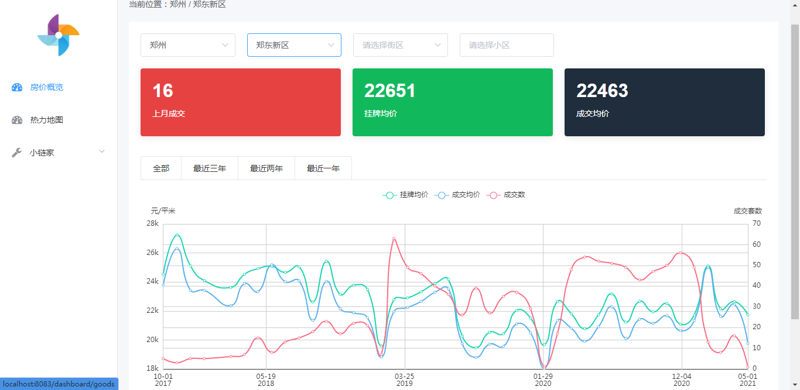

# Hi I'm kun 👋

- 📫 Email: yyk_job@163.com
- ⭐️ Blog: [KUN'BLOG](https://blog.fengxiuge.top)

**欢迎来到我的GITHUB主页，以下是我的业余开发的项目，请多支持！**

## 小链家

小链家是我开发的一个展示二手房价格曲线的项目，主要功能是从 [链家网](www.lianjia.com) 二手房成交数据，然后以可视化图表加以展示。

项目体验地址：https://house.fengxiuge.top/

后端仓库地址：[house-viewer](https://github.com/yakunyue/house-viewer)

前端仓库地址：[house-web](https://github.com/yakunyue/house-web/tree/service-unify)

项目页面截图：

## 郑房曲线小程序

我开发了一个微信公众号和一个小程序，名字都叫：**郑房曲线**

跟我一样关心郑州房价的小伙伴们可以关注一下。

扫码关注公众号

扫码体验小程序

